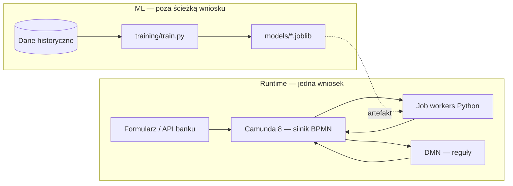

# Architektura: ML pipeline, Camunda, workery, GKE, Kafka

Skondensowany opis **wyłącznie** warstw technicznych (bez procedur biznesowych szczegółowych).  
Szczegółowa lista jobów: **[WORKERS.md](WORKERS.md)**. GKE + Camunda: **[gke-camunda-cheatsheet.md](https://github.com/OlehKondratow/camunda8-tutorial/blob/main/docs/gke-camunda-cheatsheet.md)**.  
Skala (użytkownicy, Keycloak/Azure, SQL, wersje modeli, data lake): **[docs/operations-scale-identity-data.md](docs/operations-scale-identity-data.md)**.

---

## 1. Widok logiczny

- **Orkiestracja:** Camunda 8 (Zeebe wykonuje BPMN; Tasklist / Operate — UI i historia).
- **Ciężka logika skoringu:** worker(i) Zeebe (`pyzeebe`), **inference** z joblib.
- **Polityka:** DMN (lub worker `c8jw-credit-route` w wariancie pipeline).
- **Uczenie modelu:** osobny tor (batch / notebook → artefakt), **nie** w kroku procesu dla jednej wnioski.

---

## 2. ML pipeline

| Faza | Komponent | Wyjście |
|------|-----------|---------|
| **Eksploracja / prototyp** | `notebooks/credit-scoring-eda-ml.ipynb` | Hipotezy, metryki |
| **Trening** | `training/train.py` (+ opcjonalnie `data/train.csv`) | `models/credit_model.joblib` (`model` + `state` preprocessorów) |
| **Wnioskowanie (runtime)** | `worker/scoring.py` — `CreditScorer` | `defaultProbability`, `predictedDefault`, `creditMlModelVersion` |

Wersjonowanie: nowa wersja modelu = nowy plik / ścieżka `MODEL_PATH` (rejestr artefaktów, ConfigMap z wersją, itd. — poza tym repo).

---

## 3. Camunda 8

| Element | Rola w projekcie |
|---------|------------------|
| **BPMN** | `bpmn/*.bpmn` — przepływ: formularz → worker(y) → DMN → wynik (`c8cs-full-modeler.bpmn` i warianty uproszczone) |
| **DMN** | `dmn/c8cs-post-ml-policy.dmn` — decyzja `c8cs_credit_policy` → `creditPolicyDecision` |
| **Formularze** | `forms/*.form` — powiązane z user task (`formId`) |
| **Silnik** | Zeebe — **job workers** po **gRPC** (`ZEEBE_ADDRESS` = host:port bramki) |

Integracja z bankiem: zmienne procesu ustawiane z backendu (REST/Zeebe/Zeebe user tasks) albo z formularza Camundy; worker **nie** zastępuje systemu źródłowego (np. pobrania informacji kredytowej) — tylko liczy score na już dostarczonych polach.

---

## 4. Workerzy Zeebe (lista)

| Job type | Plik | Zadanie |
|----------|------|---------|
| `c8jw-credit-validate` | `worker/validate.py` | Walidacja wymaganych zmiennych |
| `c8jw-credit-score` | `worker/scoring.py` | ML inference |
| `c8jw-credit-route` | `worker/route.py` | Routing progowy (alternatywa dla DMN w `credit-score-pipeline.bpmn`) |

**Jeden proces OS:** `worker/run_worker.py` — wybór handlerów przez `WORKERS` (przecinek).

Mapowanie BPMN → job types: **WORKERS.md**.

---

## 5. GCP / GKE — warstwa infrastruktury

| Obszar | Typowe elementy |
|--------|------------------|
| **Klaster** | GKE Autopilot lub Standard — namespace dedykowany pod Camundę i workery (np. `camunda`, `c8cs-workers`) |
| **Camunda Platform** | Helm chart / operator — `zeebe-gateway` jako Service `ClusterIP` lub `LoadBalancer`; worker ustawia `ZEEBE_ADDRESS=camunda-platform-zeebe-gateway....:26500` |
| **Workery kredytowe** | `Deployment` (repliki N≥1), ta sama etykieta co w `kubernetes/` rodzica: obraz z Artifact Registry, `imagePullSecrets` jeśli potrzebne |
| **Model** | `emptyDir` + initContainer z GCS, **PVC** z modelem, lub wbudowany obraz z warstwą `COPY models/` — decyzja operacyjna |
| **Tożsamość** | Workload Identity — Kubernetes SA → GCP SA dla odczytu sekretów / modelu z GCS |

Szczegóły poleceń `gcloud`, Helm, port-forward: **docs/gke-camunda-cheatsheet.md** (katalog nadrzędny).

---

## 6. Kafka — rola opcjonalna

Zeebe **nie** konsumuje Kafki natywnie dla jobów (aktywacja przez gRPC poll). Kafka ma sens **obok** Camundy:

| Wzorzec | Opis |
|---------|------|
| **Zdarzenia domenowe** | Backend banku publikuje np. `ApplicationSubmitted` → konsument aktualizuje CRM / anticor; równolegle start instancji BPMN przez REST Zeebe / Connectors |
| **Integracja asynchroniczna** | Worker lub mikrousługa po zakończeniu joba emituje event dla kolejek downstream (np. antifraud, DWH) |
| **Outbox** | Transakcja DB + wpis do outbox → producent Kafka — spójność z ERP |

**Camunda 8:** możliwe **Connectors** / małe usługi, które czytają z Kafki i wołają Zeebe (publish message / start process) — poza zakresem minimalnego demo w tym folderze.

---

## 7. Podsumowanie przepływu

1. **GKE:** pody Camundy + pody workerów (ten sam VPC; dostęp do bramki Zeebe).
2. **Runtime:** BPMN → job types → Python workers → zmienne → DMN → user task / koniec.
3. **ML:** trening batch → `joblib`; produkcja tylko inference.
4. **Kafka:** opcjonalny szkielet zdarzeń banku, niezastępujący gRPC workerów.

5. **KEDA** (GKE): autoskalowanie **replik workerów** wg metryki kolejki (Prometheus / custom) lub **lagu Kafka** — zob. **[docs/operations-scale-identity-data.md](docs/operations-scale-identity-data.md)** § KEDA.
